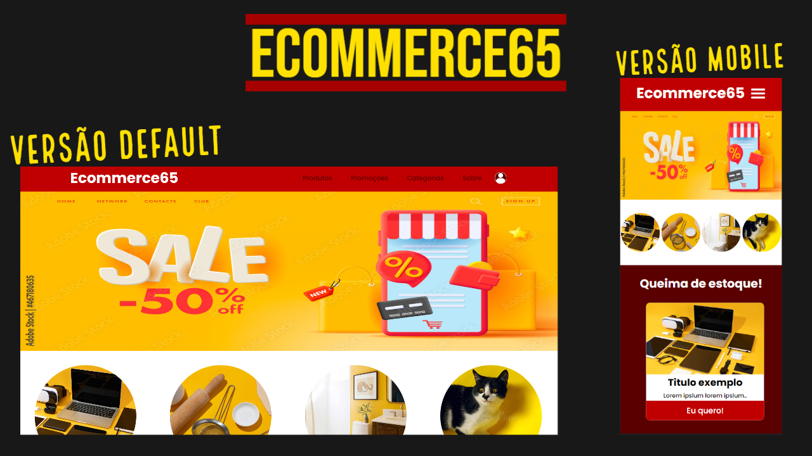

# Ecommerce65

Ainda em construção! criado por para aplicar conceitos de React JS + React router-dom!

## Front-end desenvolvido com React JS

Deploy: https://6478e78e4f267500cad57ccf--loquacious-florentine-aec6c3.netlify.app

 

## Skills usadas

 
    

## Aviso:
<ul>
  <li>Ainda em desenvolvimento, apenas as páginas Home e Products criada até o momento e ainda falta eu refatorar o código já disponivel, aguarde por futuras atualizações!</li>
</ul>

## Versão 0.0.2.1, ainda em construção:
<ol>
  <li>- Seções Header, Banner, Products, Highlights e Footer.</li>
  <li>- Responsividade com diversos tamanhos de tela!.</li>
  <li>- Banners já funcionando!.</li>
  <li>- Botão do menu mobile já funcionando!.</li>
  <li>- Duas páginas disponiveis, página Home e página Products.</li>
  <li>- Adição de animações criadas com CSS puro, sem dependência de bibliotecas externas.</li>
  <li>- Uso do display-grid para organizar os produtos em 2X2(2 linhas X 2 colunas).</li>
  <li>- Correção de bug no tamanho da font-text da logo(Estava muito pequena em alguns dispositivos).</li>
</ol>

## Rodar o Ecommerce:
<ol>
  <li>Crie a (tela-de-comandos/prompt) no diretorio principal do projeto.</li>
  <li>Instale as dependencias: npm install</li>
  <li>Rode projeto: npm run dev</li>
</ol>
