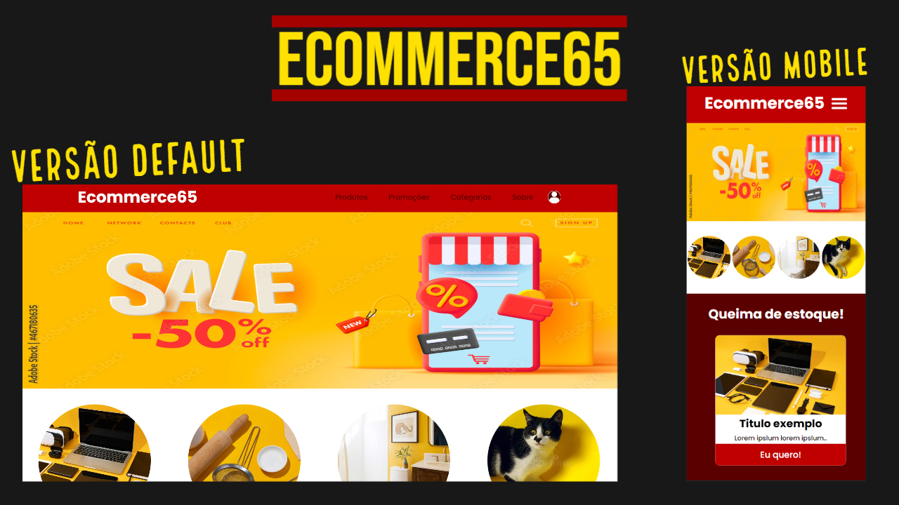

# Ecommerce65

Ainda em construção! criado por para aplicar conceitos de React JS + React hooks + React router-dom!

## Front-end desenvolvido com React JS 

Deploy: https://649b39542884620722e52e87--loquacious-florentine-aec6c3.netlify.app

 

## Skills usadas

 
    

## Atualização nos componentes Products e Promotions, versão 0.0.2.4:
<ol>
  <li>- Componente Promotions só irá renderizar os 4 primeiros produtos do objeto "products".</li>
  <li>- Componente Products irá renderizar apenas 6 produtos por vez, em ordem aleatoria do objeto "products" que simula um JSON.</li>
  <li>- Correção de erros de estilização no componente "Products" e "Promotions" no botão de "comprar agora" na versão mobile onde o texto estava estourando para fora do botão.</li>
  <li>- Mudanças de estilização no componente "Products" e "Promotions" nas resoluções maiores que 1000vw(largura), agora usamos "display:grid" para organizar os produtos, anteriormente usavamos "display:flex".</li>
</ol>

## versão 0.0.2.4, ainda em construção:
<ol>
  <li>- Seções Header, Banner, Products, Highlights e Footer.</li>
  <li>- Responsividade com diversos tamanhos de tela!.</li>
  <li>- Banners já funcionando!.</li>
  <li>- Botão do menu mobile já funcionando!.</li>
  <li>- Duas páginas disponiveis, página Home e página Products.</li>
  <li>- Adição de animações criadas com CSS puro, sem dependência de bibliotecas externas.</li>
  <li>- Uso do display-grid para organizar os produtos em 2X2(2 linhas X 2 colunas).</li>
  <li>- Correção de bug no tamanho da font-text da logo(Estava muito pequena em alguns dispositivos).</li>
  <li>- Uso de Context api e props para compartilhar dados entre os componentes.</li>
  <li>- Uso do método "map" para percorrer o objeto que simula um JSON para pegar os dados dos produtos e renderizar-los.</li>
  <li>- Compartilhamento de dados atráves do Context api e props.</li>
</ol>

## Rodar o Ecommerce:
<ol>
  <li>Crie a (tela-de-comandos/prompt) no diretorio principal do projeto.</li>
  <li>Instale as dependencias: npm install</li>
  <li>Rode projeto: npm run dev</li>
</ol>
